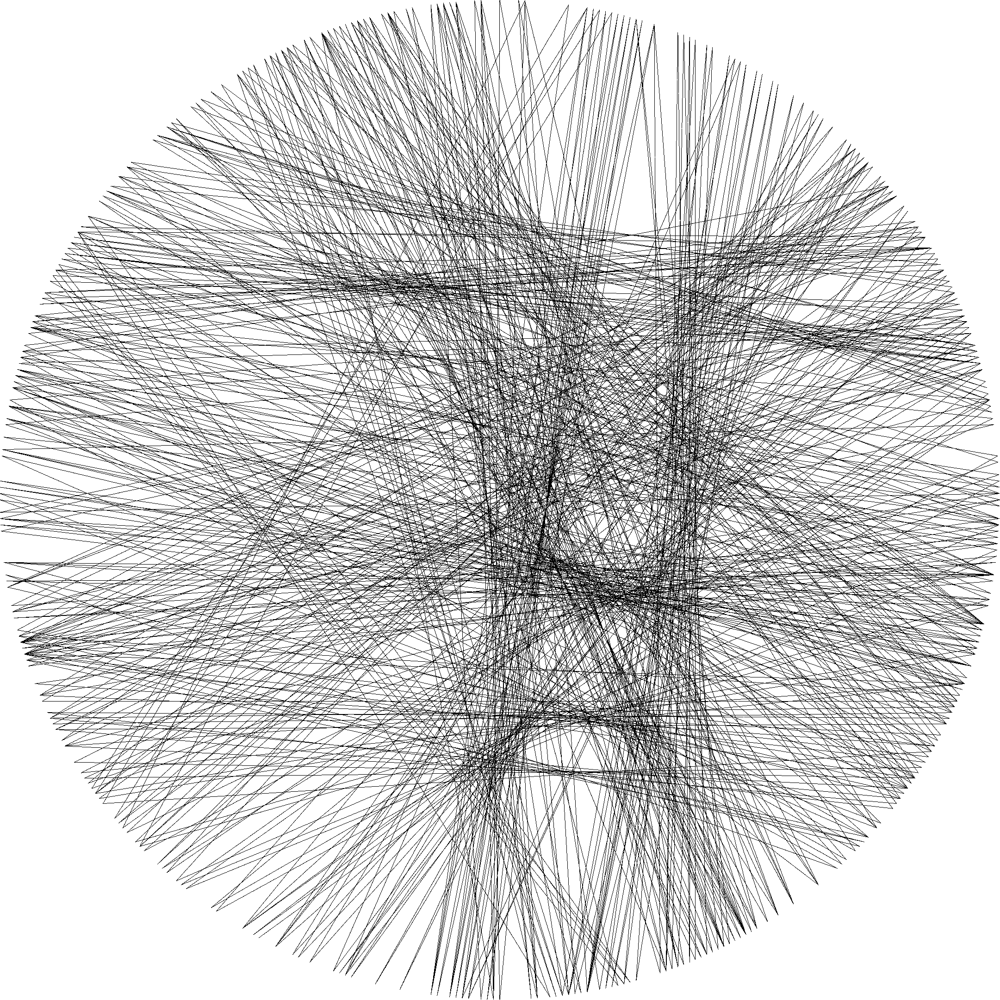
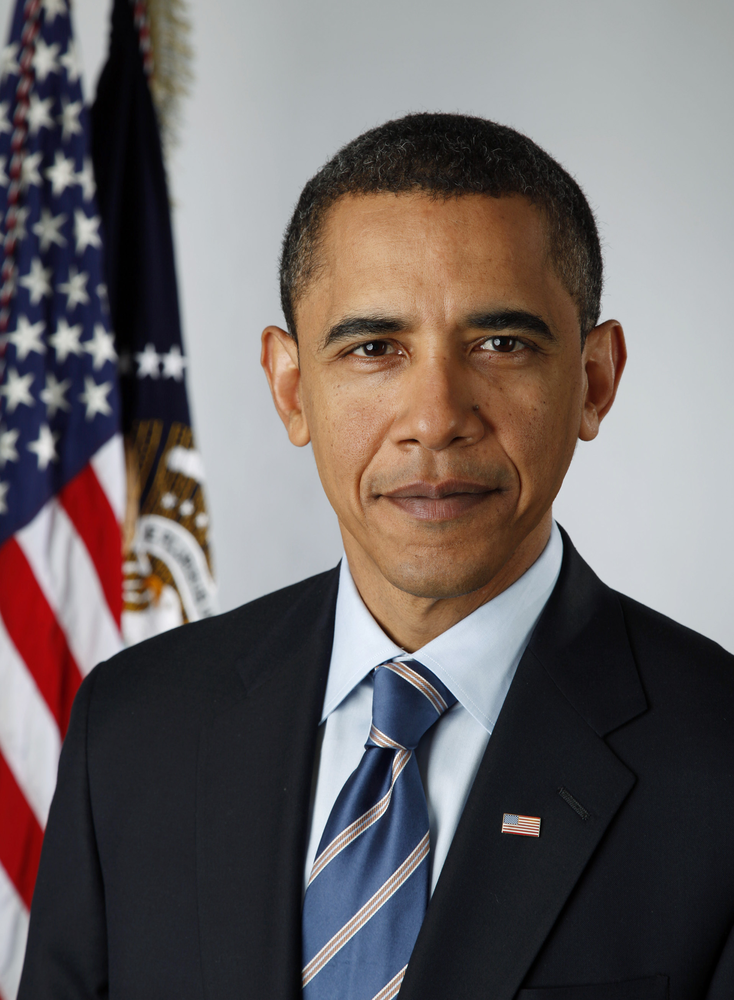

# Pipetone 🧵

🚀 A fast, Rusty port of `threadTone.py`

🌟 Full credit goes to [@theveloped](https://github.com/theveloped) for inspiring this implementation: check out their work [here](https://github.com/theveloped/ThreadTone)!

This binary crate "threads" images given the number of pins and threads to use.

1. The target image is pre-processed
1. This new image is used to draw a continuous thread across a sequence of pins on a virtual circular loom
1. The "threading" is saved to the target directory

Feedback and PRs are encouraged!

## 🛠️ Usage

### Example

This assumes the latest version of [`cargo`](https://doc.rust-lang.org/cargo/getting-started/installation.html) is installed.

```bash
❯ cargo run --release thread_me.png
```

This runs pipetone in release mode (see [Performance](#performance) and [Notes](#notes)) on `thread_me.png` (leaving it unaltered) and conjures its "threaded" twin at `./threaded.png`.

### Options

Pipetone threads circular half-tone images using a number of options:

Short Option | Long Option | Default | Description
-|-|-|-
`-p`|`--pins`|500|Number of pins on the circular loom
`-t`|`--threads`|1000|Maximum number of threads used
`-r`|`--radius`|min(height, width)|Side length of output image
`-o`|`--output`|input's parent directory|Path to output image

So this is equivalent to the above example:

```bash
❯ cargo run --release thread_me.png -l 1000 --pins 500 -o face_500_1000_threaded.png
```

### Flags

Along with these options are flags for controlling output (all default to unset):

Flag | Default? | Description
-|-|-
`--csv`|❌|Save start and end coordinates of threads to CSV
`--csv-header`|❌|Include CSV header line: `x1, y1, x2, y2`. Used with `--csv`
`--no-img`|❌|Skip image generation. Used with `--csv`

Images are generated by default; CSVs aren't.

Let's say we want to generate a CSV with a header line and skip generating the image:

```bash
❯ cargo run --release thread_me.png --csv --csv-header --no-img
```

## Output

Image and CSV output are saved in the same location (the same directory as the input image by default).

The default prefixing scheme is `<FILE STEM>_<# PINS>_<# THREADS>`, e.g.:

- `face_500_1000_threaded.png` for output images
- `face_500_1000_threads.csv` for CSVs

The contents of a generated `*.csv` file will look similar to the following (omitting the header AKA first line by default):

```csv
x1,y1,x2,y2
2160,1080,206,1714
206,1714,2117,778
2117,778,168,1658
168,1658,2057,1539
2057,1539,150,1629
...
```


## 🖼️ Results

A cherry-picked handful:

House (p=1000, l=2000)|Trump (p=1000, l=2000)|Obama (p=1000, l=5000)|Putin (p=1000, l=2000)|Boris (p=1000, l=5000)
-|-|-|-|-
||||

The patterns observed in the upper-rightmost corner of each table seem to occur when the thread can no longer fill any more of the image productively, but is able to find a sequence of pins that prevent the algorithm from halting early.

### Dr. Gregory House, M.D.


`pins/lines` | 500 | 1000 | 2000 | 5000
-|-|-|-|-
100||||
200||||
500||||
1000||||

### Donald Trump


`pins/lines` | 500 | 1000 | 2000 | 5000
-|-|-|-|-
100||||
200||||
500||||
1000||||

### Barack Obama



`pins/lines` | 500 | 1000 | 2000 | 5000
-|-|-|-|-
100||||
200||||
500||||
1000||||

### Vladimir Putin


`pins/lines` | 500 | 1000 | 2000 | 5000
-|-|-|-|-
100||||
200||||
500||||
1000||||

### Boris Johnson


`pins/lines` | 500 | 1000 | 2000 | 5000
-|-|-|-|-
100||||
200||||
500||||
1000||||

## 🚀 Performance

Rough measurement using the `time` utility yields the following execution times. The same 1920x1080 image and parameters (`threadTone.py`'s defaults) were used:

### pipetone

```bash
❯ hyperfine --warmup 3 'target/release/pipetone images/house.jpg -p 200 -r 500'
Benchmark #1: target/release/pipetone images/house.jpg -p 200 -r 500
  Time (mean ± σ):     997.9 ms ±  14.6 ms    [User: 994.5 ms, System: 95.5 ms]
  Range (min … max):   978.3 ms … 1023.3 ms    10 runs
```

### Threadtone

```bash
❯ hyperfine --warmup 3 'python3 threadTone.py images/house.jpg'
Benchmark #1: python3 threadTone.py images/house.jpg
  Time (mean ± σ):     21.941 s ±  0.513 s    [User: 22.322 s, System: 0.957 s]
  Range (min … max):   21.522 s … 23.110 s    10 runs
```

### Debug Mode: A Cautionary Tale...

```bash
❯ hyperfine --warmup 3 'target/debug/pipetone images/house.jpg -p 200 -r 500'
Benchmark #1: target/debug/pipetone images/house.jpg -p 200 -r 500
  Time (mean ± σ):     52.381 s ±  3.390 s    [User: 54.234 s, System: 0.088 s]
  Range (min … max):   48.479 s … 59.454 s    10 runs
```

## Notes

- Running in `--release` mode is recommended as the `image` crate taxes debug mode builds fairly aggressively.

## See Also

- [@thevelop](https://github.com/theveloped)'s excellent [blog post](http://www.thevelop.nl/blog/2016-12-25/ThreadTone/)
- [@danielvarga](https://github.com/danielvarga)'s [string-art](https://github.com/danielvarga/string-art) solves the same task in another interesting way.
