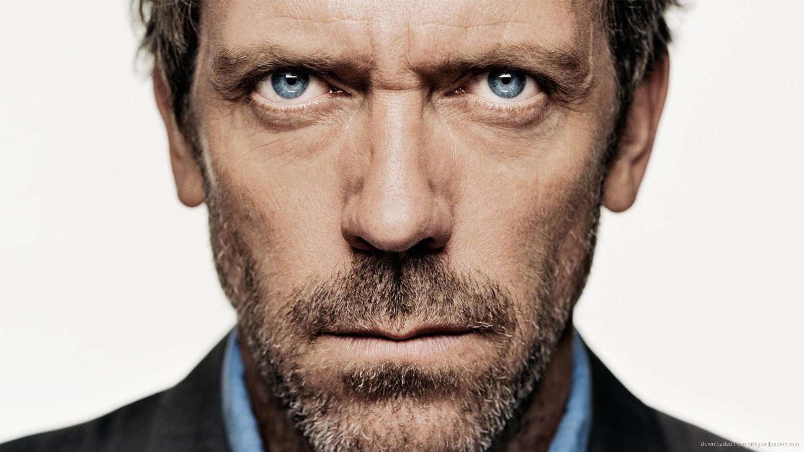
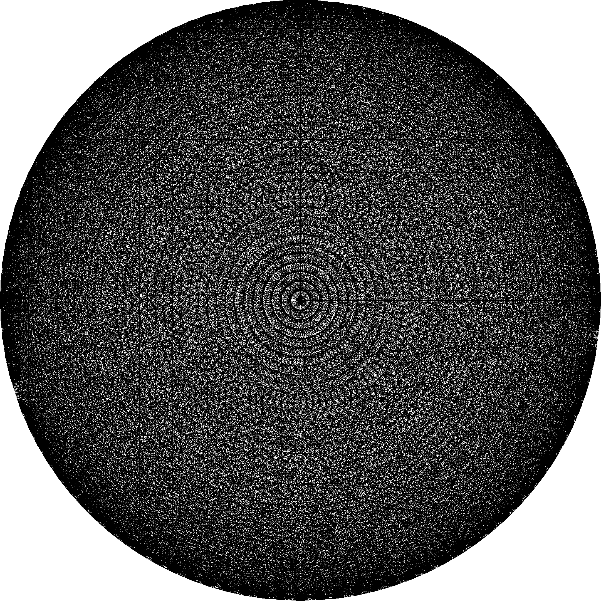
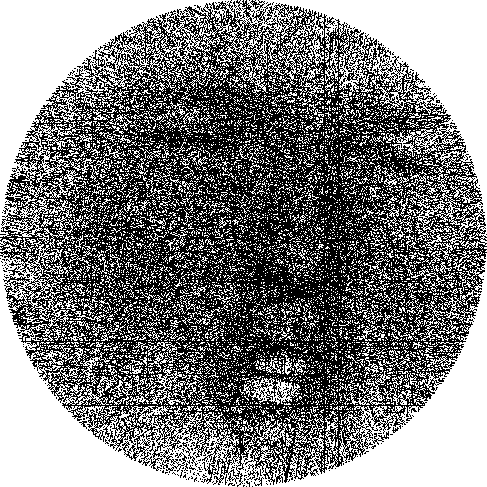

# Pipetone: a halftone representation of an image made of threads

🚀 A fast and Rusty port of `threadTone.py`

🌟 Full credit goes to [@theveloped](https://github.com/theveloped) for inspiring this implementation: check out their work [here](https://github.com/theveloped/ThreadTone)!

This binary crate converts images into their "threaded" counterparts, given information about the number of threads and pins to use.

1. The target image undergoes pre-processing transformations
1. This pre-processed image is used to draw a sequence of threads to a canvas
1. The canvas is saved to the target directory

Feedback and PRs are encouraged!

## Usage

### Example

This assumes the latest version of [`cargo`](https://doc.rust-lang.org/cargo/getting-started/installation.html) is installed.

```bash
cargo run --release thread_me.png
```

This runs pipetone in release mode (see [Performance](#performance) and [Notes](#notes)) on `thread_me.png` (leaving it unaltered) and conjures its "threaded" twin at `./threaded.png`.

### Options

Pipetone uses the following options and defaults:
Short Option | Long Option | Default | Description
-|-|-|-
`-l`|`--lines`|1000|Maximum number of lines/threads used
`-p`|`--pins`|200|Number of pins on the circular loom
`-r`|`--radius`|min(height, width)|Determines output image size: radius x radius
`-o`|`--output`|Input image directory|Output image location and/or name

According to the above table, the following command is equivalent to the example given:

```bash
cargo run --release thread_me.png -l 1000 --pins 200 -r 1000 -o threaded.png
```

## Results

A cherry-picked handful:

House (p=1000, l=2000)|Trump (p=1000, l=2000)|Obama (p=1000, l=5000)|Putin (p=1000, l=2000)|Boris (p=1000, l=5000)
-|-|-|-|-
||||

The patterns observed in the upper-rightmost corner of each table seem to occur when the thread can no longer fill any more of the image productively, but is able to find a sequence of pins that prevent the algorithm from halting early.

### Gregory House



`pins/lines` | 500 | 1000 | 2000 | 5000
-|-|-|-|-
100||||
200||||
500||||
1000||||

### Donald Trump


`pins/lines` | 500 | 1000 | 2000 | 5000
-|-|-|-|-
100||||
200||||
500||||
1000||||

### Barack Obama


`pins/lines` | 500 | 1000 | 2000 | 5000
-|-|-|-|-
100||||
200||||
500||||
1000||||

### Vladimir Putin


`pins/lines` | 500 | 1000 | 2000 | 5000
-|-|-|-|-
100||||
200||||
500||||
1000||||

### Boris Johnson


`pins/lines` | 500 | 1000 | 2000 | 5000
-|-|-|-|-
100||||
200||||
500||||
1000||||

## Performance

Rough measurement using the `time` utility yields the following execution times. The same 1920x1080 image and parameters (`threadTone.py`'s defaults) were used:

### pipetone

```bash
❯ time ./target/release/pipetone face.jpg -r 500
           _            __
    ____  (_)___  ___  / /_____  ____  ___
   / __ \/ / __ \/ _ \/ __/ __ \/ __ \/ _ \
  / /_/ / / /_/ /  __/ /_/ /_/ / / / /  __/
 / .___/_/ .___/\___/\__/\____/_/ /_/\___/
/_/     /_/

Placing thread 1000/1000

real    0m1.224s
user    0m1.266s
sys     0m0.078s
```

### Threadtone

```bash
❯ time python3 threadTone.py -p face.jpg

   __  __                        ________
  / /_/ /_  ________  ____ _____/ /_  __/___  ____  ___
 / __/ __ \/ ___/ _ \/ __ `/ __  / / / / __ \/ __ \/ _ \
/ /_/ / / / /  /  __/ /_/ / /_/ / / / / /_/ / / / /  __/
\__/_/ /_/_/   \___/\__,_/\__,_/ /_/  \____/_/ /_/\___/

...

[+] Computing line 1000 of 1000 total
[+] Image threaded

real    0m36.690s
user    0m35.984s
sys     0m0.625s
```

### Debug Mode: A Cautionary Tale...

```bash
❯ time ./target/debug/pipetone face.jpg -r 500
           _            __
    ____  (_)___  ___  / /_____  ____  ___
   / __ \/ / __ \/ _ \/ __/ __ \/ __ \/ _ \
  / /_/ / / /_/ /  __/ /_/ /_/ / / / /  __/
 / .___/_/ .___/\___/\__/\____/_/ /_/\___/
/_/     /_/

Placing thread 1000/1000

real    0m47.341s
user    0m49.375s
sys     0m0.047s
```

## Notes

- Running in `--release` mode is recommended as the `image` crate taxes debug mode builds fairly aggressively.

## See Also

- [@thevelop](https://github.com/theveloped)'s excellent [blog post](http://www.thevelop.nl/blog/2016-12-25/ThreadTone/)
- [@danielvarga](https://github.com/danielvarga)'s [string-art](https://github.com/danielvarga/string-art) solves the same task in another interesting way.
